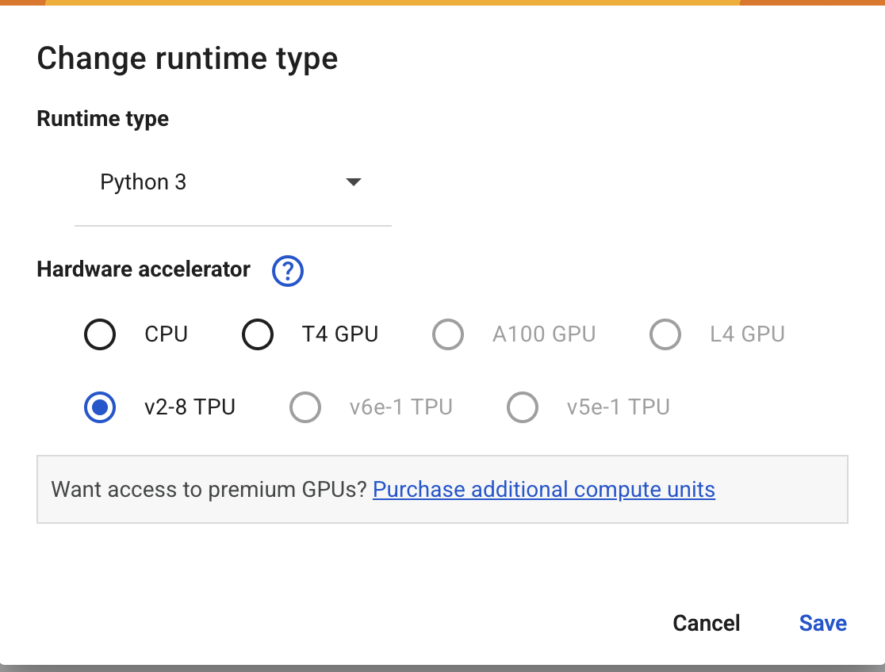

# MinText

Welcome to MinText! This repository contains hands-on tutorials for the workshop **"Scaling Large Language Models: Getting Started with Large-Scale Parallel Training of LLMs"**.

> **Note**: 🚧 MinText (the library) is currently under construction - when ready it will be a useful minimal implementation of various parallelism strategies for transformer training in JAX/Flax. In the meantime, please follow the tutorials in this repository to learn about distributed training techniques for large language models. 🚧

## Workshop Overview

As large language models (LLMs) grow increasingly larger, it is no longer possible to train them effectively with the memory capacity of single or a few GPUs. This workshop covers fundamental parallelism dimensions—data, tensor, and pipeline parallelism—and how to compose them effectively for training billion-parameter models. The content is available in the Jupyter notebooks:

1. [Parallelization Basics](docs/tutorials/1_Parallelization_Basics.ipynb)
2. [Data Parallelism and FSDP](docs/tutorials/2_Data_Parallel_and_FSDP.ipynb)
3. [Tensor Parallelism and Transformers](docs/tutorials/3_Tensor_Parallel_and_Transformers.ipynb)
4. [Up Next](docs/tutorials/4_Up_Next.ipynb)

## Running the Notebooks

The notebooks are designed to run on **Google Colab with v2-8 TPU runtime**, which provides 8 TPU devices for free. This allows you to experiment with multi-device parallelization without any cost. Before running the notebooks, make sure to select the TPU runtime by going to **Runtime > Change runtime type** and selecting **v2-8 TPU** as the hardware accelerator.



If you prefer to run the notebooks locally, you can simulate 8 devices by adding the following at the beginning of each notebook:

```python
import os
os.environ["XLA_FLAGS"] = '--xla_force_host_platform_device_count=8' # Use 8 CPU devices
```

You can also view the pre-executed notebooks with all outputs at: https://mintext.readthedocs.io

## Acknowledgments

Most of the explanations and code in these tutorials are adapted from:

- [JAX Documentation](https://docs.jax.dev/en/latest/index.html)
- [Flax Documentation](https://flax.readthedocs.io/en/latest/)
- [How to Scale Your Model](https://jax-ml.github.io/scaling-book/)

## License

This project is licensed under [MIT License](LICENSE).